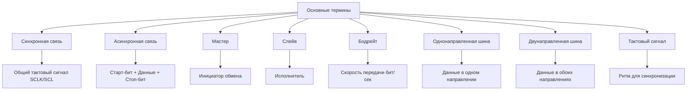
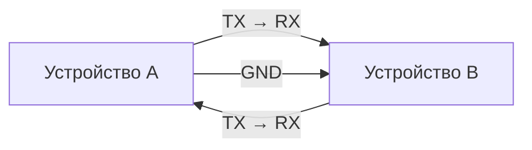
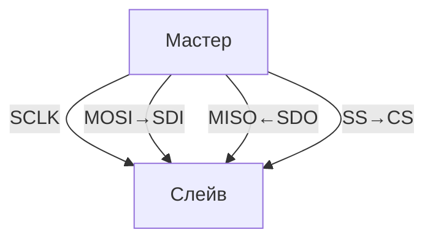
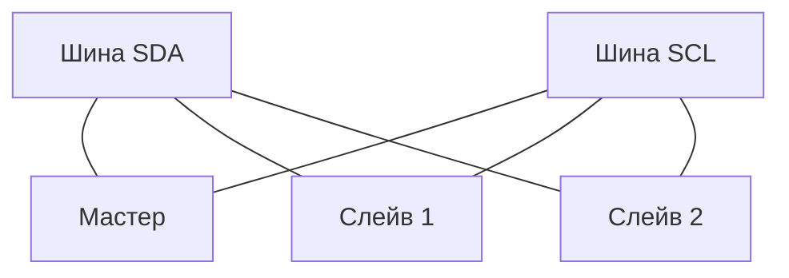
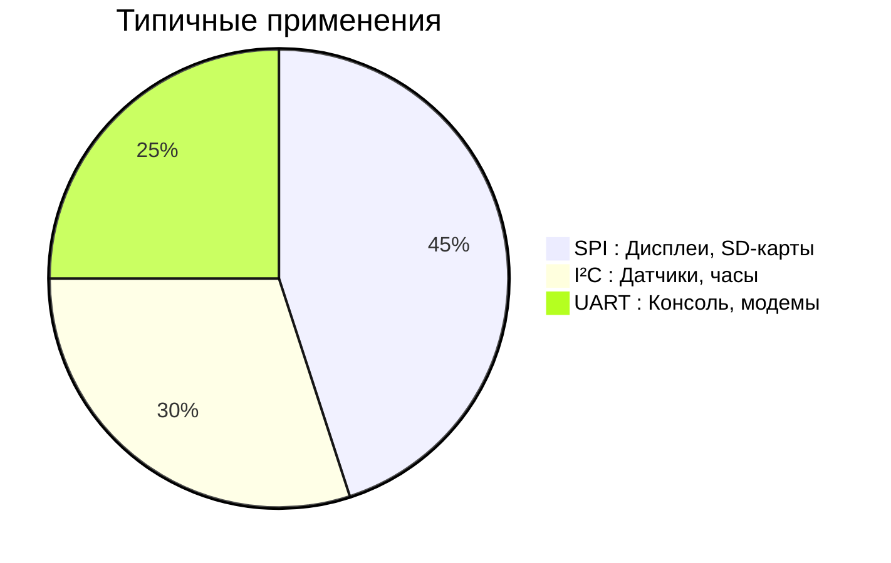

# Принципы работы протоколов связи UART, SPI, I²C

## Основные термины

---

## 1. UART (Universal Asynchronous Receiver/Transmitter)

### Схема подключения

### Принцип работы:
- Асинхронный протокол (без тактового сигнала)
- Формат передачи: `[Старт-бит(0)] + [Данные] + [Стоп-бит(1)]`
- Требует одинакового бодрейта на обоих устройствах

### Жизненный пример: 
Два человека обмениваются записками через посыльного:
1. Отправитель говорит "Начинаю!" (старт-бит)
2. Читает письмо слово за словом с одинаковой скоростью (бодрейт)
3. Говорит "Конец!" в конце (стоп-бит)
4. Получатель читает в том же темпе

**Реальное применение:** Передача данных между Arduino и датчиком температуры

---

## 2. SPI (Serial Peripheral Interface)

### Схема подключения

### Принцип работы:
1. Мастер выбирает слейва (SS=0)
2. Передает данные в такт "барабану" (SCLK)
3. Слейв отвечает одновременно

### Жизненный пример:
Учитель в классе:
1. Указывает на ученика (активация SS)
2. Задает вопрос под метроном (такты SCLK)
3. Ученик отвечает в такт метронома
4. Одновременно учитель может задавать новый вопрос, а ученик отвечать на предыдущий
5. Учитель переключается на другого ученика (деактивация SS)

**Реальное применение:** Подключение SD-карты к Raspberry Pi

---

## 3. I²C (Inter-Integrated Circuit)

### Схема подключения

### Принцип работы:
1. Мастер начинает собрание (START)
2. Вызывает сотрудника по имени (адрес)
3. Обменивается сообщениями с подтверждением (ACK)
4. Завершает собрание (STOP)

### Жизненный пример:
Совещание в офисе:
1. Руководитель (мастер) говорит "Начинаем!" (START)
2. Обращается к сотруднику: "Василий, отчет?" (адрес + запрос)
3. Василий подтверждает: "Слушаю" (ACK)
4. Руководитель дает указания (передача данных)
5. Василий периодически подтверждает "Понял" (ACK)
6. Руководитель говорит "Совещание окончено!" (STOP)

**Реальное применение:** Подключение датчиков температуры и влажности к умному дому

---

## Сравнение протоколов

| Параметр               | UART                          | SPI                            | I²C                            |
|------------------------|-------------------------------|--------------------------------|--------------------------------|
| **Аналогия**           | Обмен записками               | Урок с метрономом              | Офисное совещание              |
| **Тип связи**          | Асинхронный                  | Синхронный                    | Синхронный                    |
| **Минимум проводов**   | 3                            | 4                             | 2                             |
| **Скорость**           | До 1 Мбит/с                  | До 100 Мбит/с                 | До 3.4 Мбит/с                 |
| **Устройств на шине**  | 2                            | Много (с отдельными SS)       | До 128                        |

## Вывод
- **UART** - простой чат между двумя устройствами  
- **SPI** - быстрый диалог с выбором собеседника  
- **I²C** - групповая конференция с адресацией участников
